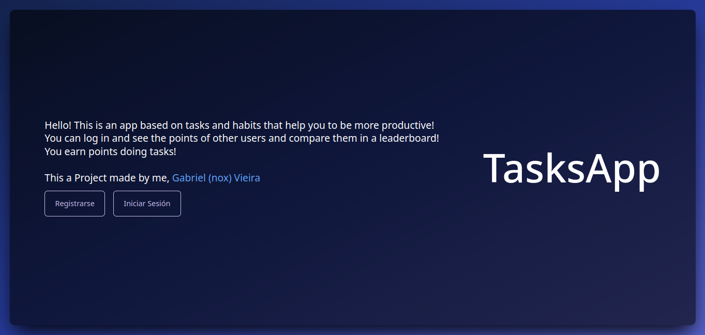
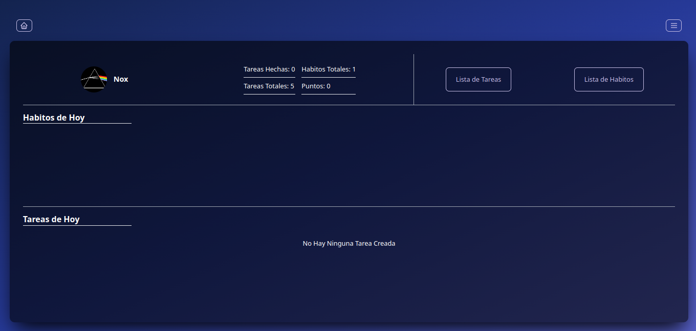
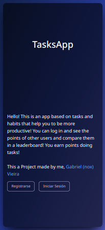
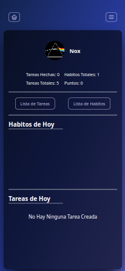

# Tasksapp (Una simple App de tareas)

Este es mi **primer proyecto**. Una **aplicación web** desarrollada usando **Server Side Rendering (SSR)** y **JavaScript FullStack** y conexión a una **Base de datos** local, desplegada en **[Railway](https://railway.app)**.

## Características Técnicas:
* Crear, Leer, Actualizar y Eliminar registros **(CRUD)**.
* Server Side Rendering.
* Templates **([Handlebars](https://handlebarsjs.com))**.
* Arquitectura MVC.
* Registro y autenticación de usuarios.
* Validaciones.
* Responsive Design.
* entre otras...

## Características Básicas:
* Crear, Editar y Eliminar tareas y hábitos.
* Ver detalles sobre las tareas y hábitos.
* Marcar tareas como "Hecha".
* Ganar puntos por cada tarea hecha.
* Ver tabla de clasificación para comparar puntos con otros usuarios.
* Registro de usuario.
* Cambiar nombre de usuario y contraseña.
* Poder eliminar la cuenta.
* entre otras...

## Tecnologías utilizadas:
* Frontend
    * Vanilla JavaScript.
    * [Tailwindcss](https://tailwindcss.com).
    * [Handlebars](https://handlebarsjs.com).
* Backend
    * [Nodejs](https://nodejs.org).
    * [Express](https://expressjs.com).
    * [PostgreSQL](https://postgresql.org) (Base de Datos).
    * [Passport.js](https://passportjs.org) (Autenticación de usuarios).

## Configuración del Entorno de Desarrollo

* Clonar el repositorio:
```shell
$ git clone https://github.com/nox456/tasksapp
```

* Ejecutar el servidor de desarrollo:
```shell
$ cd tasksapp
$ npm run dev
```

Y listo!

## Screenshots

### Landing (Escritorio)


### Dashboard (Escritorio)


### Landing (Movíl)


### Dashboard (Movíl)

